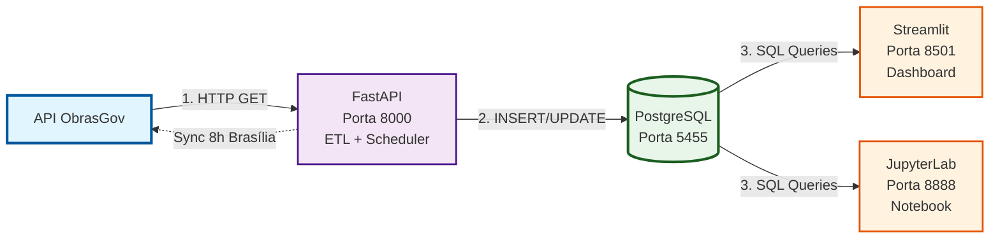
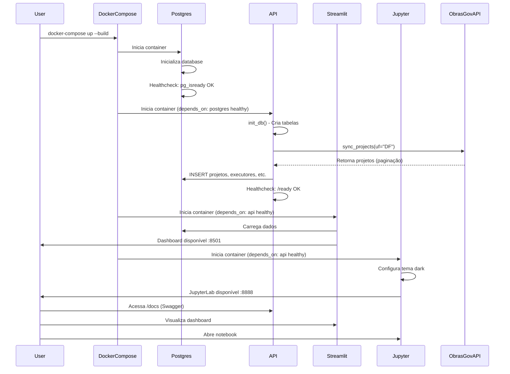
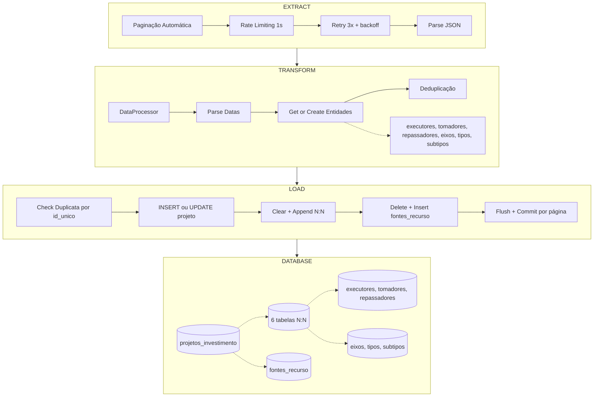
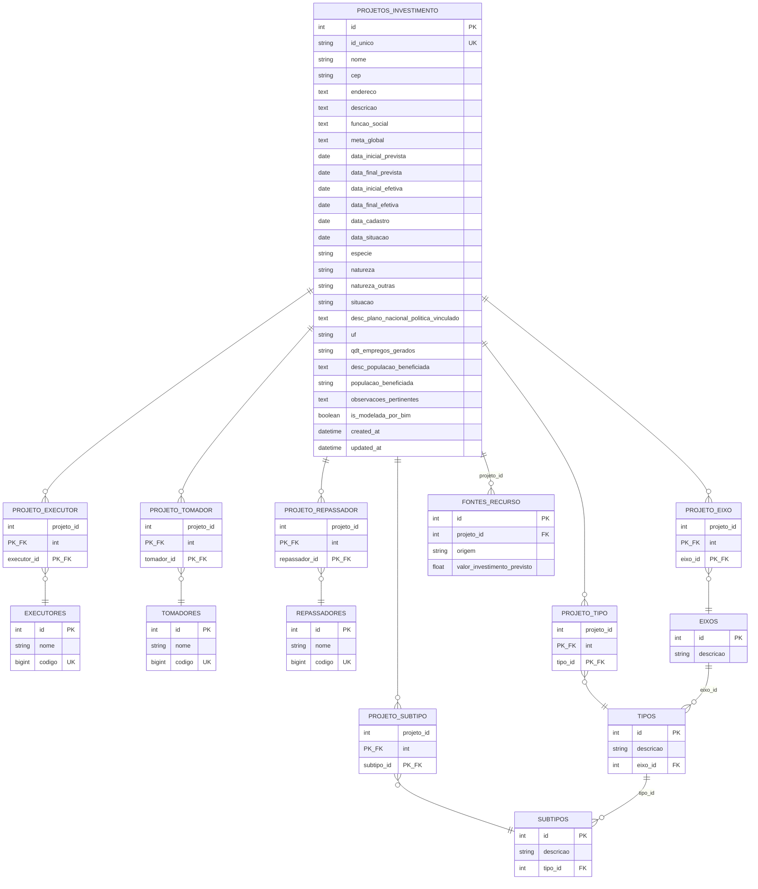
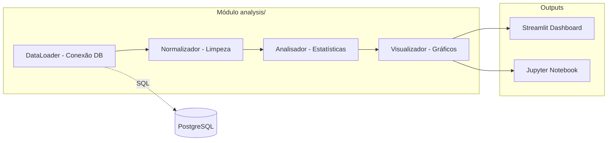
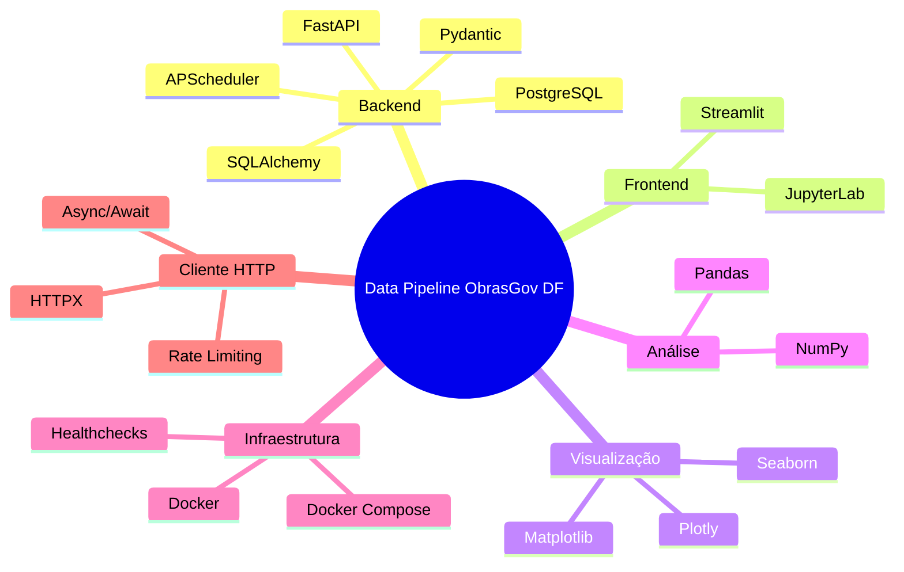
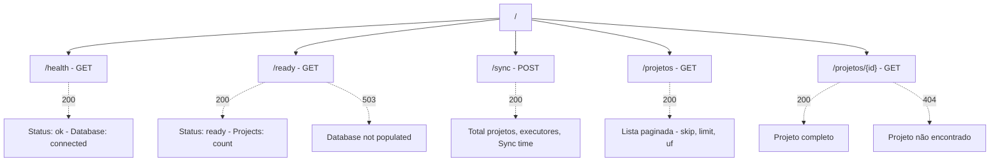
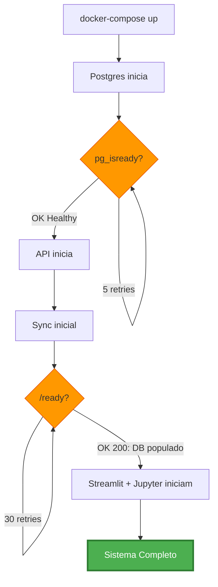

# Arquitetura do Sistema - Data Pipeline ObrasGov DF

## Visão Geral da Arquitetura

## Fluxo de Inicialização

## Pipeline ETL Detalhado

## Estrutura do Banco de Dados

## Componentes de Análise

## Stack Tecnológico

## Portas e Endpoints

| Serviço | Porta | URL | Descrição |
|---------|-------|-----|-----------|
| **PostgreSQL** | 5455:5432 | `postgresql://localhost:5455/obrasgov_db` | Banco de dados |
| **FastAPI** | 8000:8000 | `http://localhost:8000` | API REST |
| **FastAPI Docs** | 8000:8000 | `http://localhost:8000/docs` | Swagger UI |
| **Streamlit** | 8501:8501 | `http://localhost:8501` | Dashboard |
| **JupyterLab** | 8888:8888 | `http://localhost:8888` | Notebook |

## Endpoints da API

## Agendamento e Automação

```mermaid
gantt
    title Ciclo de Sincronização Automática
    dateFormat HH:mm
    axisFormat %H:%M

    section Sync Diário
    Sync Agendado 8h Brasília      :crit, 08:00, 30m

    section API
    API Running        :active, 00:00, 24h

    section Dashboards
    Streamlit Available :active, 00:00, 24h
    Jupyter Available   :active, 00:00, 24h
```

## Healthchecks e Dependências

---

**Documentação Técnica**
- Todos os containers estão na rede isolada `obrasgov_network`
- Healthchecks garantem ordem de inicialização
- Sync automático executa diariamente às 8h da manhã (Brasília)
- Volume persistente mantém dados do PostgreSQL
